## Prepare Win32 app content for upload - Java 8

### Download offline version of the application. 

https://java.com/en/download/manual.jsp

### You need scripts that you will put in intune. For Java they look like this:

32-bit:

Install command
```
jre-8u351-windows-i586.exe INSTALL_SILENT=1 AUTO_UPDATE=0 REBOOT=0
```
Uninstall command
```
MsiExec.exe /X{26A24AE4-039D-4CA4-87B4-2F32180351F0} /qn
```
###### HKEY_LOCAL_MACHINE\SOFTWARE\WOW6432Node\Microsoft\Windows\CurrentVersion\Uninstall\{26A24AE4-039D-4CA4-87B4-2F32180351F0}

64-bit:

Install command
```
jre-8u351-windows-x64.exe INSTALL_SILENT=1 AUTO_UPDATE=0 REBOOT=0
```
Uninstall command
```
MsiExec.exe /X "{26A24AE4-039D-4CA4-87B4-2F64180351F0}" /qn
```
###### HKEY_LOCAL_MACHINE\SOFTWARE\Microsoft\Windows\CurrentVersion\Uninstall\{26A24AE4-039D-4CA4-87B4-2F64180351F0}

### You need registry key as well. If you don’t have one. You can install the app on your local computer and search for it. They are usually under:

###### HKEY_LOCAL_MACHINE\SOFTWARE\Microsoft\Windows\CurrentVersion\Uninstall

### Download IntuneWinAppUtil.exe

https://github.com/Microsoft/Microsoft-Win32-Content-Prep-Tool

### Prepare two folders “in” and “out”. Copy your application to “in” folder

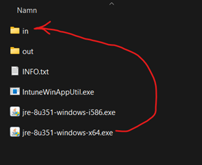

### Now you can run IntuneWinAppUtil.exe as administrator
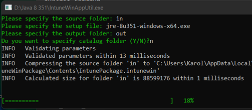

### It will run for a few seconds and the window will close. In “out” folder you should see a .intunewin file
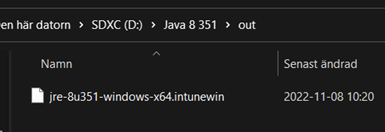

### Now you can go to https://endpoint.microsoft.com/ > Apps > Windows. Click Add
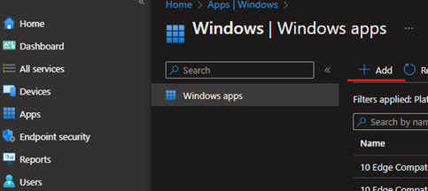

### Choose Windows app (win32)
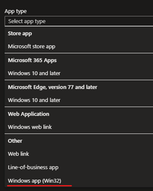

### Choose your .intunewin file
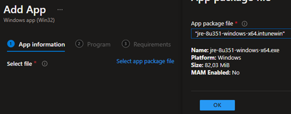
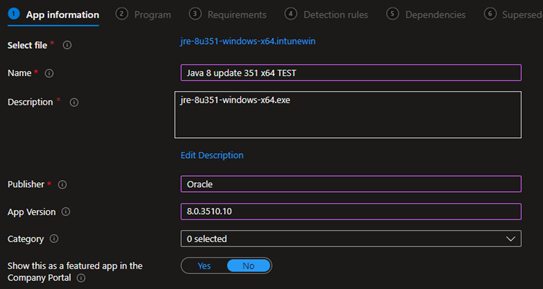
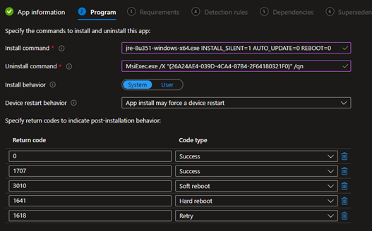
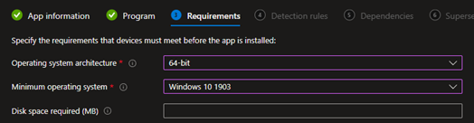

### As detection rule you can use registry 
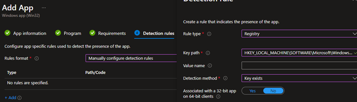

### Or file path and version. 
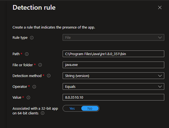

### Choose a group for your workstations
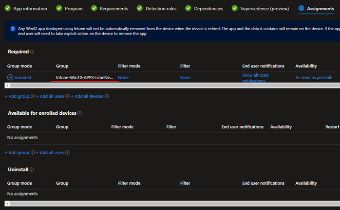
